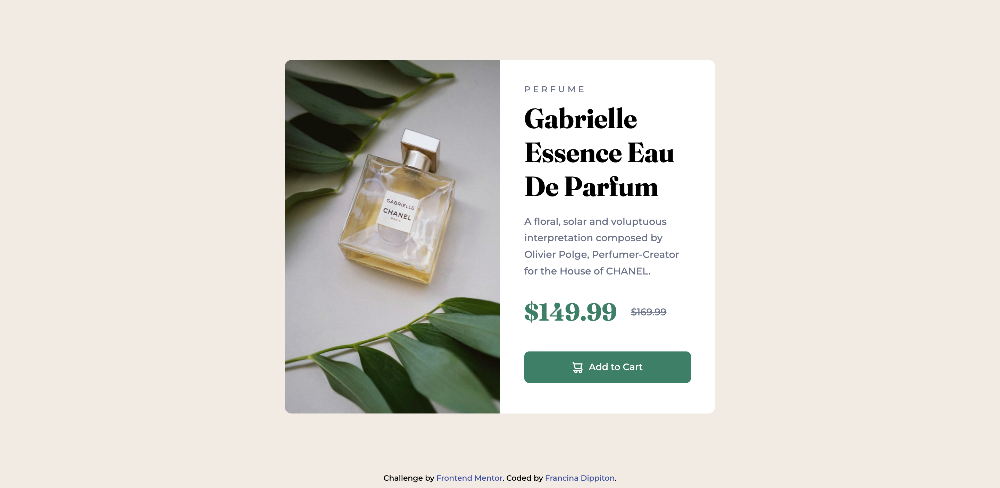
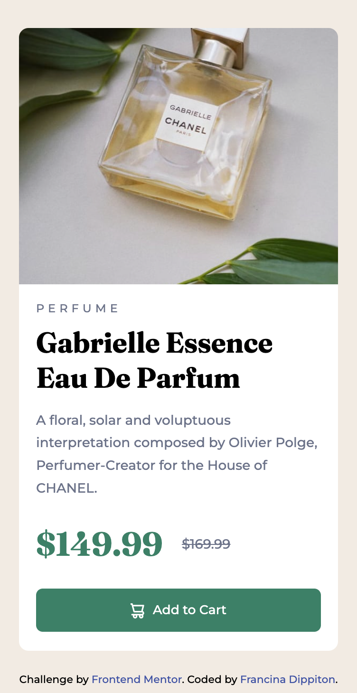
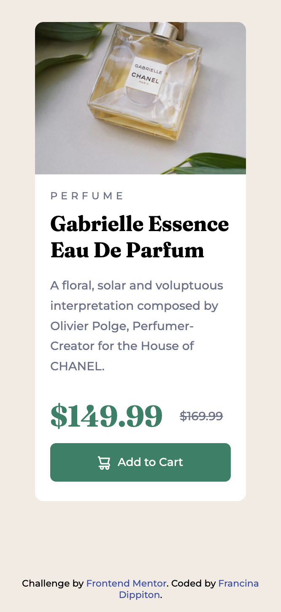

# Frontend Mentor - Product preview card component solution

This is a solution to the [Product preview card component challenge on Frontend Mentor](https://www.frontendmentor.io/challenges/product-preview-card-component-GO7UmttRfa). Frontend Mentor challenges help you improve your coding skills by building realistic projects. 


## Table of contents

- [Overview](#overview)
  - [The challenge](#the-challenge)
  - [Screenshot](#screenshot)
  - [Links](#links)
- [My process](#my-process)
  - [Built with](#built-with)
  - [What I learned](#what-i-learned)
  - [Continued development](#continued-development)
  - [Useful resources](#useful-resources)
- [Author](#author)
- [Acknowledgments](#acknowledgments)


## Overview

### The challenge

Users should be able to:

- View the optimal layout depending on their device's screen size
- See hover and focus states for interactive elements

### Screenshots

#### Screenshot Desktop 1440px


#### Screenshot Mobile 376px


#### Screenshot Mobile 333px


### Links

- Solution URL: [product-card](https://github.com/fdippiton/product-card/)
- Live Site URL: [product-card](https://fdippiton.github.io/product-card/)

## My process

### Built with

- HTML5
- CSS
- Flexbox

### What I learned

I had the opportunity to implement my knowledge of html, css and flexbox, in such a way that it can greatly improve my skills in these tools.

```css
/* MEDIA QUERIES */
@media (min-width: [width]) and (max-width: [width]) {
  /* ... */
}

/* VARIABLES */
:root {
   --dark-cyan: hsl(158, 36%, 37%);
}

/* FILTERS */
.card__image--perfume {
    filter: brightness(80%);
    filter: saturate(100%);
}

/* USE VARIABLES */
.card__description--details {
    color: var(--dark-grayish-blue);
}

/* EXPAND AN IMAGE */
.card__image--perfume {
    object-fit: cover;
}
```

### Continued development

### Useful resources

## Author

- Website - [product-card](https://fdippiton.github.io/product-card/)
- Frontend Mentor - [@fdippiton](https://www.frontendmentor.io/profile/fdippiton)
- Twitter - [@f_dippiton](https://www.twitter.com/f_dippiton)


## Acknowledgments

